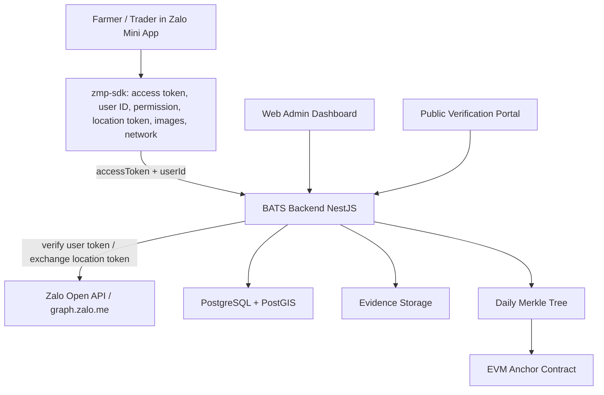

# BATS implementation plan — App/Product + Zalo Mini App

Updated: 2026-07-14.

This plan reflects the current BATS workspace. It is written as an execution
checklist: what already exists, what must be implemented next, and how to
connect the Zalo Mini App correctly.

## 0. Current baseline

### Already implemented

- NestJS backend with harvest, transfer, verification, admin, evidence, anchor,
  health, metrics and OpenAPI.
- PostgreSQL/PostGIS persistence through Prisma, six migrations and seed data.
- Admin dashboard for actor, farm plot and audit-log management.
- Public GS1 Digital Link-style verification and EPCIS JSON-LD export.
- Rule Engine v1 with seven rule families: geofence, yield, duplicate evidence,
  time, role, weight and device anomaly.
- Local content-addressed evidence upload and SHA-256 hashing.
- Merkle proof generation and local EVM anchoring with Hardhat/Anvil.
- Staging Docker flow with PostGIS, backend and web.
- Zalo Mini App scaffold with guest auth, role select, farmer harvest flow,
  collector receiving flow, history, queue and profile pages.
- IndexedDB/localStorage offline queue for harvest and transfer submissions,
  filtered by the active actor to avoid account data leakage.
- Zalo Mini App now starts from the register/login screen on each app open
  instead of auto-restoring a cached user session.

### Still deferred or incomplete

- Real Zalo Mini App ID, verification, permissions, device testing and publishing.
- Production Zalo token verification and location-token exchange.
- Zalo device testing on Android/iOS inside the Zalo app for both farmer and
  collector roles.
- Google Maps production key/Map ID.
- Public testnet/mainnet anchor provider and key custody.
- Managed object storage such as S3/MinIO.
- Production deployment, domain, TLS and clean Git release.

## 1. Target architecture



Principle: the Mini App never decides actor identity by itself. It only obtains
Zalo credentials and device evidence; the backend verifies Zalo data, maps the
Zalo user to a BATS actor, validates events and then issues a BATS actor token.

## 2. Product implementation phases

### Phase A — Stabilize current local/staging MVP

Goal: make the current project reproducible before connecting external Zalo
services.

Tasks:

1. Create clean baseline Git commit and tag.
2. Run:

   ```bash
   pnpm typecheck
   pnpm test
   pnpm build
   ```

3. Verify staging:

   ```bash
   pnpm staging:up -- .env.staging.example
   curl http://localhost:4400/health
   pnpm staging:token
   ```

4. Confirm admin can:
   - create/update/deactivate actors;
   - assign `zaloUserId`;
   - create/update farm plots;
   - view audit logs.

Exit criteria:

- Web loads locally.
- Backend health shows database/evidence OK.
- Admin login works.
- E2E test passes.

### Phase B — Backend Zalo production integration

Goal: replace temporary admin-issued actor token flow with verified Zalo identity.

Current backend endpoint:

- `POST /auth/zalo/exchange`

Current behavior:

- receives `{ accessToken, userId }`;
- calls `ZALO_USER_INFO_URL`;
- compares verified Zalo ID with claimed `userId`;
- finds BATS actor by `zaloUserId`;
- returns BATS actor token.

Required hardening:

1. Set env:

   ```env
   ZALO_USER_INFO_URL=https://graph.zalo.me/v2.0/me
   ZALO_APP_SECRET=...
   ZALO_MINI_APP_ID=...
   ```

2. Update backend verification to support:
   - user access-token verification;
   - location-token exchange;
   - clear Zalo error handling;
   - retry-safe error responses.

3. Add endpoint:

   ```http
   POST /auth/zalo/location/resolve
   Authorization: Bearer BATS_ACTOR_TOKEN
   Content-Type: application/json

   {
     "zaloAccessToken": "...",
     "locationToken": "..."
   }
   ```

   Backend then calls Zalo Open API:

   ```http
   GET https://graph.zalo.me/v2.0/me/info
   headers:
     access_token: <zaloAccessToken>
     code: <locationToken>
     secret_key: <ZALO_APP_SECRET>
   ```

4. Return normalized location:

   ```json
   {
     "provider": "gps",
     "latitude": 12.6789,
     "longitude": 108.1234,
     "timestamp": "2026-07-13T..."
   }
   ```

5. Store minimal auth/audit information:
   - actor ID;
   - Zalo user ID;
   - login time;
   - no raw Zalo secret in logs.

Exit criteria:

- Unknown Zalo user cannot get a BATS token.
- Known actor with matching `zaloUserId` gets a one-hour BATS token.
- Location token is resolved by backend, not trusted from frontend.

### Phase C — Zalo Mini App UI and SDK bridge

Goal: connect the existing Zalo scaffold to real Zalo APIs.

Current files:

- `apps/zalo-mini-app/src/zalo-session.ts`
- `apps/zalo-mini-app/src/pages/HarvestPage.tsx`
- `apps/zalo-mini-app/src/pages/CollectorPage.tsx`
- `apps/zalo-mini-app/src/offline-queue.ts`

Current UI status:

- Guest screen supports register/login with a `Vai trò` field for `Nông dân`
  and `Thương lái`.
- Farmer can create harvest records with manual harvest-area input, GPS,
  evidence, quantity and offline queue fallback.
- Collector can receive a farmer lot by entering GS1/lot code, farmer phone,
  received weight, GPS and evidence.
- Queue and history are scoped to the current actor ID, so logging into another
  account does not display the previous account's queue/history.
- Profile supports normal logout and logout plus local device data deletion.
- The default app entry is register/login; cached sessions are not auto-restored
  when the Mini App opens.

Required production changes:

1. Replace browser-only/fallback assumptions in `zalo-session.ts`.
2. Use `getAccessToken()` and `getUserID()` for login.
3. Use `authorize()` only when scopes are needed:
   - `scope.userInfo` for name/avatar;
   - `scope.userLocation` for location;
   - `scope.userPhonenumber` only if truly needed.
4. Use `getLocation()` as a token-returning API. Send that token to backend for
   exchange; do not assume it returns raw latitude/longitude in production.
5. Use `chooseImage()` or camera APIs to collect evidence files.
6. Upload evidence to backend first:

   ```http
   POST /evidence/upload
   Authorization: Bearer BATS_ACTOR_TOKEN
   multipart/form-data
   ```

7. Use returned SHA-256 hashes in:

   ```http
   POST /batches/harvest
   Authorization: Bearer BATS_ACTOR_TOKEN
   x-idempotency-key: <offline-item-id>
   ```

8. Store offline queue items as:

   ```ts
   {
     id: string;              // idempotency key
     endpoint: "/batches/harvest" | "/batches/transfer";
     payload: CreateHarvestInput;
     evidenceFiles: LocalFileRef[];
     createdAt: string;
     attempts: number;
     actorTokenSnapshot?: string;
   }
   ```

9. On sync:
   - refresh/re-exchange Zalo session if BATS token expired;
   - upload evidence;
   - submit harvest with the same idempotency key;
   - delete item only after HTTP 201/200 success.

Exit criteria:

- Farmer and collector can open Mini App in Zalo on Android/iOS.
- User can login through Zalo identity or the approved production auth flow.
- User can grant location permission only when creating harvest/receiving events.
- Offline harvest/transfer is queued under the correct actor and syncs exactly once.

#### Phase C.1 — Zalo QR Code & Real Device Testing Guide (Troubleshooting DEV Mode & QR Errors)

When scanning the Mini App QR code from a mobile device (`Zalo App`), if the app fails to open or gets stuck on loading, it is **not due to missing database records**. Instead, verify these 5 critical checklist items:

1. **Check DEV Mode & Tester Permissions**:
   - If the Mini App displays the `DEV` badge in the QR screen, only the owner or explicitly added developers/testers can open it.
   - Go to **Zalo Mini App Dashboard** -> `Quản lý` -> `Người dùng` -> `Phân quyền` -> `Tester` and add the Zalo phone number/account used for testing.

2. **Public HTTPS Domain / Tunneling (`ngrok` / `cloudflared`)**:
   - Mobile phones cannot access `localhost:3500` or `localhost:4000` via QR.
   - **Option A (Quick Tunnel Test)**: Start local services (`pnpm dev:all`), then use `ngrok` or `cloudflared` to tunnel port `3500` (Mini App frontend) and port `4000` (Backend API). Configure the public HTTPS URL in the Zalo Dashboard (`Cấu hình Domain`).
   - **Option B (Deploy Build Package)**: Run `pnpm --filter @bats/zalo-mini-app build` and upload the output folder `apps/zalo-mini-app/dist-app` via the Zalo Dashboard (`Quản lý phiên bản`).

3. **Verify App ID Sync (`786922732143670563`)**:
   - Ensure `ZALO_MINI_APP_ID=786922732143670563` is set in root `.env`, root `.env.example`, `apps/zalo-mini-app/.env`, and `zmp-config.json`. Do not reuse old App IDs (`6377...`).

4. **Frontend API Pointer (`apps/zalo-mini-app/.env`)**:
   - Ensure `VITE_API_URL` and `VITE_VERIFY_URL` point to public HTTPS domain endpoints when testing on physical mobile devices inside Zalo App.

5. **Grant Minimum Required Permissions (`listPSC`)**:
   - In Zalo Dashboard -> `Permission`, ensure `Thông tin người dùng (scope.userInfo)` and `Vị trí (scope.userLocation)` are requested and approved for testing.

### Phase D — Admin preparation for Zalo actors

Goal: admin can onboard real farmers/traders before pilot.

Tasks:

1. Add/edit actor fields:
   - role;
   - organization;
   - phone;
   - `zaloUserId`;
   - status.
2. Add "Zalo onboarding" admin workflow:
   - create actor;
   - paste verified Zalo user ID;
   - issue temporary token only for testing;
   - revoke/deactivate actor.
3. Add CSV import for pilot farmers if needed.
4. Add audit logs for every `zaloUserId` change.

Exit criteria:

- Admin can map a Zalo account to one active actor.
- Duplicate `zaloUserId` is rejected.
- Deactivated actor cannot sync from Mini App.

### Phase E — Device testing and Zalo review

Goal: pass Zalo test/review and prepare for pilot.

Tasks:

1. Create Zalo App on Zalo for Developer.
2. Create Mini App in the Mini App management portal.
3. Verify Mini App by OA or required documents.
4. Request required permissions:
   - user info only if name/avatar are used;
   - location for harvest geofence;
   - camera/album for evidence;
   - phone number only if absolutely necessary.
5. Explain every permission in the UI before requesting it.
6. Test in Zalo on:
   - Android;
   - iOS;
   - weak network;
   - offline queue;
   - expired BATS token;
   - duplicate submission.
7. Submit testing version for review.
8. After approval, publish production version.

Exit criteria:

- Mini App does not crash.
- Load time and UX are acceptable.
- Permission request flow is clear.
- Zalo reviewer can complete harvest flow.

## 3. Detailed Zalo connection checklist

### 3.1 Create and verify Mini App

1. Go to Zalo for Developer and create/activate a Zalo App.
2. Go to the Mini App management portal.
3. Create a Mini App under the Zalo App.
4. Record:
   - `ZALO_MINI_APP_ID`;
   - Zalo App ID;
   - Zalo App Secret.
5. Verify the Mini App by OA or documents.

### 3.2 Configure local/staging env

Backend `.env`:

```env
ZALO_USER_INFO_URL=https://graph.zalo.me/v2.0/me
ZALO_APP_SECRET=<secret-from-zalo-developer>
ZALO_MINI_APP_ID=<mini-app-id>
WEB_ORIGINS=http://localhost:3000,http://localhost:3500,http://localhost:3400
```

Zalo app `.env`:

```env
VITE_API_URL=http://localhost:4000
ZALO_MINI_APP_ID=<mini-app-id>
```

Staging `.env.staging`:

```env
PUBLIC_API_URL=http://localhost:4400
WEB_ORIGINS=http://localhost:3400,http://localhost:3500
ZALO_USER_INFO_URL=https://graph.zalo.me/v2.0/me
ZALO_APP_SECRET=<secret>
ZALO_MINI_APP_ID=<mini-app-id>
```

### 3.3 Install/run local Mini App

```bash
pnpm install
pnpm dev:zalo
```

Mini App dev server uses:

```text
http://localhost:3500
```

For full local stack:

```bash
pnpm dev:all
```

### 3.4 Backend exchange flow

Mini App:

```ts
const zaloAccessToken = await getAccessToken();
const userId = await getUserID();
const response = await fetch(`${apiBaseUrl}/auth/zalo/exchange`, {
  method: "POST",
  headers: { "content-type": "application/json" },
  body: JSON.stringify({ accessToken: zaloAccessToken, userId })
});
const batsSession = await response.json();
```

Backend:

1. Verify access token with Zalo.
2. Extract verified Zalo user ID.
3. Compare with frontend `userId`.
4. Find active actor by `zaloUserId`.
5. Return BATS token.

### 3.5 Location flow

Mini App:

```ts
await authorize({ scopes: ["scope.userLocation"] });
const { token: locationToken } = await getLocation();
const response = await fetch(`${apiBaseUrl}/auth/zalo/location/resolve`, {
  method: "POST",
  headers: {
    "content-type": "application/json",
    authorization: `Bearer ${batsAccessToken}`
  },
  body: JSON.stringify({ zaloAccessToken, locationToken })
});
const location = await response.json();
```

Backend exchanges `locationToken` with Zalo using `ZALO_APP_SECRET`, then uses
the resulting latitude/longitude in harvest payload validation.

### 3.6 Evidence flow

Mini App:

1. `chooseImage({ sourceType: ["camera", "album"], count: 3 })`
2. Convert selected path/file to uploadable form data.
3. `POST /evidence/upload`
4. Receive SHA-256 hash.
5. Submit hash in `POST /batches/harvest`.

### 3.7 Offline flow

When offline:

1. Create queue item with a stable `id` as idempotency key.
2. Store payload and local evidence references in IndexedDB.
3. On network restored:
   - exchange/refresh session;
   - resolve fresh location if required;
   - upload evidence;
   - submit harvest with same `x-idempotency-key`;
   - delete from IndexedDB only after success.

## 4. API mapping

| Mini App action | Zalo SDK/API | BATS backend |
| --- | --- | --- |
| Login | `getAccessToken`, `getUserID` | `POST /auth/zalo/exchange` |
| Request location | `authorize`, `getLocation` | `POST /auth/zalo/location/resolve` |
| Capture evidence | `chooseImage` / camera APIs | `POST /evidence/upload` |
| Create harvest | offline queue + fetch | `POST /batches/harvest` |
| Transfer batch | fetch | `POST /batches/:id/transfer` |
| Queue sync | `onNetworkStatusChange` + browser `online` | idempotent replay |
| QR verify | `scanQRCode` optional | `/01/:gtin/10/:lot/21/:serial` |

## 5. Security checklist

- Never put `ZALO_APP_SECRET` in Mini App frontend.
- Backend must verify Zalo token before issuing BATS token.
- Backend must map by verified `zaloUserId`, not by client-submitted name/phone.
- Do not log Zalo access tokens, location tokens, app secrets or raw personal data.
- Use short-lived BATS actor tokens.
- Keep idempotency key stable for offline queued events.
- Evidence files must be hashed server-side.
- Request only permissions required for the current action.

## 6. Testing checklist

### Local browser fallback

- `pnpm dev:zalo`
- Can open harvest page outside Zalo.
- Fallback location works.
- Offline queue stores item.

### Staging API

- `pnpm staging:up -- .env.staging`
- `POST /auth/zalo/exchange` returns 503 until Zalo env is configured.
- Admin-issued temporary actor token still works for benchmark/dev only.

### Real Zalo device

- Android login.
- iOS login.
- Permission explanation screen.
- Location token exchange.
- Evidence upload.
- Offline harvest creation.
- Online sync exactly once.
- Deactivated actor blocked.
- Unknown Zalo user blocked.

## 7. Implementation order for the next sprint

1. Add backend `POST /auth/zalo/location/resolve`.
2. Update `zalo-session.ts` so `getLocation()` sends token to backend.
3. Update `offline-queue.ts` to include authorization and evidence upload.
4. Align Mini App payload with backend `CreateHarvestInput`:
   - `farmPlotId`, not `plotId`;
   - `variety`, not only `cropType`;
   - `eventTime`;
   - `location`;
   - `evidenceHashes`.
5. Add admin UI field for `zaloUserId` if not already visible.
6. Add tests for:
   - unknown Zalo user;
   - mismatched Zalo ID;
   - expired token;
   - offline duplicate replay.
7. Create real Mini App in Zalo portal and configure env.
8. Run device test and prepare review package.

## 8. Official Zalo references checked

- Getting started and deployment flow: https://docs.zaloplatforms.com/docs/MA/intro/getting-started
- API overview and supported APIs: https://docs.zaloplatforms.com/docs/MA/api/intro
- `getAccessToken`: https://docs.zaloplatforms.com/docs/MA/api/user/user-information/getAccessToken
- `authorize`: https://docs.zaloplatforms.com/docs/MA/api/user/authorization/authorize
- `getLocation`: https://docs.zaloplatforms.com/docs/MA/api/location/getLocation
- Publishing/review: https://docs.zaloplatforms.com/docs/MA/intro/public-mini-program
